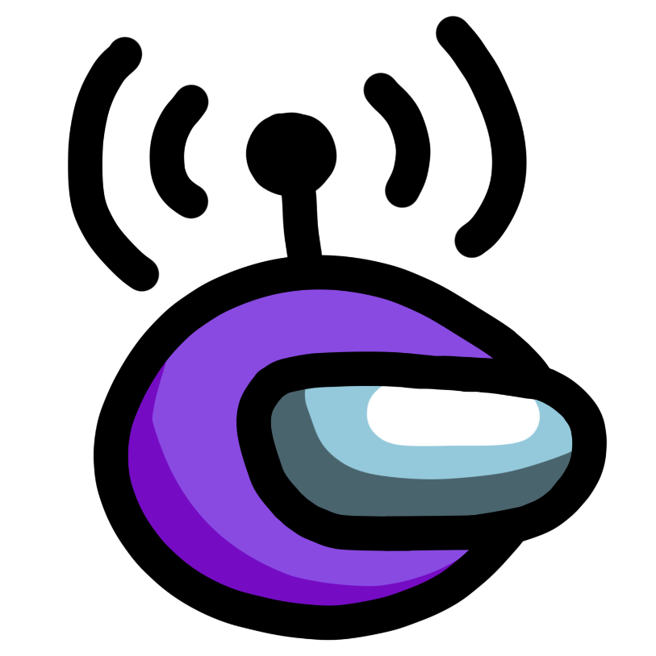

[![GPL-3.0 License][license-shield]][license-url] [![Appveyor Build][appveyor-shield]][appveyor-url]

<br />
<p align="center">
  <a href="https://github.com/impostietalkie/CrewLink-mobile">
    
  </a>

  <h3 align="center">Impostie Talkie Mobile</h3>

  <p align="center">
    Free, open, Among Us proximity voice chat.
    <br />
    <a href="https://github.com/impostietalkie/CrewLink-mobile/issues">Report Bug</a>
    ·
    <a href="https://github.com/impostietalkie/CrewLink-mobile/issues">Request Feature</a>
    ·
    <a href="#installation"><b>INSTALLATION INSTRUCTIONS</b></a>
  </p>
</p>


<!-- TABLE OF CONTENTS -->
## Table of Contents

* [About the Project](#about-the-project)
* [Installation](#installation)
* [Development](#development)
  * [Prerequisites](#prerequisites)
  * [Setup](#setup)
* [Contributing](#contributing)
* [License](#license)


<!-- ABOUT THE PROJECT -->
## About The Project

This project implements proximity voice chat in Among Us for non PC players. As long as 1 player in the lobby is running the master version the rest can play on any device and join voice chat with this website.

## Installation

Download the latest version from [releases](https://github.com/impostietalkie/CrewLink-mobile/releases) and run the `CrewLink-Setup-X.X.X.exe` file. You may get antivirus warnings, because this program hooks into the Among Us process to read game data.

If you can, you should use a private server by deploying [this repository](https://github.com/impostietalkie/CrewLink-server).

## Development

You only need to follow the below instructions if you are trying to modify this software. Otherwise, please download the latest version from the [github releases](https://github.com/impostietalkie/CrewLink-mobile/releases).

Server code is located at [impostietalkie/CrewLink-server](https://github.com/impostietalkie/CrewLink-server). Please use a local server for development purposes.

### Prerequisites

This is an example of how to list things you need to use the software and how to install them.
* [Python](https://www.python.org/downloads/)
* [node.js](https://nodejs.org/en/download/)
* yarn
```sh
npm install yarn -g
```

### Setup

1. Clone the repo
```sh
git clone https://github.com/impostietalkie/CrewLink-mobile.git
cd CrewLink-mobile
```
2. Install NPM packages
```sh
yarn install
```
3. Run the project
```JS
yarn dev
```

<!-- CONTRIBUTING -->
## Contributing

Any contributions you make are greatly appreciated.

1. Fork the Project
2. Create your Feature Branch (`git checkout -b feature/AmazingFeature`)
3. Commit your Changes (`git commit -m 'Add some AmazingFeature'`)
4. Push to the Branch (`git push origin feature/AmazingFeature`)
5. Open a Pull Request


## License

Distributed under the GNU General Public License v3.0. See `LICENSE` for more information.


[license-shield]: https://img.shields.io/github/license/impostietalkie/CrewLink.svg?style=flat-square
[license-url]: https://github.com/impostietalkie/CrewLink-server/blob/master/LICENSE
